# DS-AUDITORIA-ARQUITETURA — `opea-ui` (Fase 0, somente leitura)

> Avaliação qualitativa de arquitetura do design system, com foco na **relação entre componentes**. Nada foi editado. Toda afirmação aponta `arquivo:linha`. Onde não há evidência direta, está marcado como **hipótese**.
>
> Stack: React 19 + Vite + Tailwind v4 + Radix (shadcn "new-york") + CVA + tanstack-table. Inventário: **56** primitivos em `src/ui`, **16** patterns em `src/patterns` (15 `.tsx` + barrel), `src/lib` (`cn`, `format`), 1 hook. Cobertura de stories: **56/56 ui e 15/15 patterns** (PascalCase em `src/stories/**`).

---

## 1. Mapa de dependências (relação entre componentes)

### 1.1 Grafo de imports internos

Camadas reais: `lib/` (utilitários) → `ui/` (primitivos) → `patterns/` (domínio). A regra de ouro ("dependência só flui para baixo") **é respeitada**: não há primitivo importando pattern, nem ciclos.

```mermaid
graph TD
  subgraph lib
    cn[lib/utils: cn]
    fmt[lib/format]
  end
  subgraph ui [ui/ primitivos]
    button; dialog; label; toggle; input; separator; skeleton; tooltip
    table; sheet; popover; command; navigation-menu; dropdown-menu; opea-logo; stepper
    alert-dialog; calendar; carousel; pagination; sidebar; pin-dialog; form; toggle-group
  end
  subgraph patterns [patterns/ domínio]
    account-selector; app-shell; data-table; detail-drawer; wizard-layout
    hero-balance-card; money-text; stat-card; surface-card; toolbar
  end

  alert-dialog --> button
  calendar --> button
  carousel --> button
  pagination --> button
  sidebar --> button & input & separator & skeleton & tooltip
  command --> dialog
  pin-dialog --> dialog
  form --> label
  toggle-group --> toggle

  account-selector --> popover & command
  app-shell --> opea-logo & navigation-menu & dropdown-menu & tooltip
  data-table --> table
  detail-drawer --> sheet
  wizard-layout --> stepper
  hero-balance-card --> money-text & stat-card
  money-text --> fmt
```

(Quase todos os arquivos importam `cn` de `lib/utils`; omitido por densidade.)

### 1.2 Leitura do grafo

| Métrica | Resultado | Evidência |
| :-- | :-- | :-- |
| **Ciclos** | **Zero** | varredura de imports em `src/ui` e `src/patterns` |
| **Violação de camada** (primitivo → pattern) | **Zero** | `grep "@/patterns" src/ui` → nenhum resultado |
| **Lógica de app** (router/fetch/query) | **Quase zero** (1 exceção saudável) | `app-shell` injeta link via prop `renderLink` ([app-shell.tsx:69](src/patterns/app-shell.tsx:69)) em vez de importar router |
| **Primitivo mais central** | `button` (5 dependentes: alert-dialog, calendar, carousel, pagination, sidebar) | seção 1.1 |
| **Acoplamento alto** | `sidebar` (importa 5 primitivos) e `app-shell` (4) | esperado para shells; não é problema |

**Conclusão da relação estrutural:** o **eixo vertical** (camadas/ciclos) está **forte**. O problema não é a hierarquia — é o **eixo horizontal de composição**: muitos patterns **reinventam markup de primitivo em vez de compô-lo** (seção 3, CRÍTICO-3). É aí que mora a maior fragilidade de "relação entre componentes".

---

## 2. Notas por dimensão (A–G)

| Dim. | Critério | Veredito | Resumo |
| :-: | :-- | :-- | :-- |
| **A** | Arquitetura / relação entre componentes | **Adequado** | Camadas e ausência de ciclos são fortes; composição horizontal fraca e vazamentos pontuais de lógica de app puxam para baixo. |
| **B** | Consistência de API | **Frágil** | `variant` vs `tone` divergem; `cn()` vs concatenação de template; nem todo componente é `forwardRef`/`asChild`. |
| **C** | Tokens e tematização | **Frágil** | **Duas fontes de tokens concorrentes** (uma morta); literais de marca em 3 componentes. |
| **D** | Composição e flexibilidade | **Adequado** | `asChild`/Slot bem usados em `button`/`surface-card`; anulado por forks que não compõem (`base-modal`, `filter-bar`). |
| **E** | Acessibilidade | **Adequado** | Base Radix é sólida; furos nos componentes feitos à mão (`base-modal`, `magic-input`, `filter-bar`, `data-row`). |
| **F** | Escalabilidade e manutenção | **Frágil** | Tema novo hoje **exige** desfazer a duplicação de tokens; sem barrel em `ui/`; barrel de patterns incompleto; pacote não configurado para consumo. |
| **G** | Robustez | **Adequado** | Tipagem forte (`DataTable<T>`), poucos `any` (7, quase todos em `chart`); estados não-felizes presentes onde importa. |

### Evidência por dimensão

**A — Adequado.** Forte: zero ciclos / zero violação de camada (seção 1). Fraco: composição horizontal (CRÍTICO-3) e dois vazamentos de domínio — `magic-input` embute regra de negócio bancária ([magic-input.tsx:49-62](src/ui/magic-input.tsx:49): regex de boleto 47-48 dígitos, payload Pix `000201`) e `app-shell` carrega o modelo de conta do IB (`activeAccount: {apelido, agencia, conta, saldo, aggregatedBalance}`, [app-shell.tsx](src/patterns/app-shell.tsx)) e reimplementa `formatBRL` localmente ([app-shell.tsx:89](src/patterns/app-shell.tsx:89)) violando o "single source of truth" de [format.ts](src/lib/format.ts).

**B — Frágil.** `Badge` usa eixo `variant` ([badge.tsx:10](src/ui/badge.tsx:10)); `StatusBadge` usa eixo `tone` ([status-badge.tsx:22](src/ui/status-badge.tsx:22)) para o mesmo conceito de "cor semântica". `Button` mescla `className` dentro do `cva` ([button.tsx:43](src/ui/button.tsx:43)) enquanto `Badge` mescla por fora ([badge.tsx:33](src/ui/badge.tsx:33)). `Button`/`SurfaceCard` são `forwardRef` + `asChild`; `Badge` é função simples sem ref nem `asChild` ([badge.tsx:32](src/ui/badge.tsx:32)). Props crípticas em `DataRow` (`k`/`v`, [data-row.tsx:4-6](src/ui/data-row.tsx:4)).

**C — Frágil.** Detalhado em CRÍTICO-1 e CRÍTICO-2.

**D — Adequado.** Bom: `Slot`/`asChild` em [button.tsx:41](src/ui/button.tsx:41) e [surface-card.tsx:40](src/patterns/surface-card.tsx:40); `app-shell` injeta `renderLink`. Ruim: `base-modal` reimplementa overlay em vez de compor `Dialog` (CRÍTICO-3).

**E — Adequado.** Primitivos Radix entregam foco/Esc/aria por padrão. Furos nos itens feitos à mão: `BaseModal` é um overlay manual sem foco preso, sem Esc, sem `role="dialog"` ([base-modal.tsx:22-43](src/ui/base-modal.tsx:22)); o segmented control de `FilterBar` são `<button>` soltos sem `role`/estado selecionado acessível ([filter-bar.tsx:43-54](src/patterns/filter-bar.tsx:43)); `MagicInput` não associa label ao input. `StatusBadge` acerta o princípio "texto + cor, nunca só cor" ([status-badge.tsx:74](src/ui/status-badge.tsx:74)).

**F — Frágil.** Ver teste de escalabilidade (seção 4) e IMPORTANTE-7/8.

**G — Adequado.** `DataTableColumn<T>`/`DataTableProps<T>` genéricos ([data-table.tsx:21,38](src/patterns/data-table.tsx:21)). `any` concentrado em `chart.tsx` (idiom shadcn de recharts) + 1 em `field-wrapper`. `FileUploader` modela loading/erro/sucesso ([file-uploader.tsx](src/ui/file-uploader.tsx)).

---

## 3. Inventário de problemas por severidade

### 🔴 CRÍTICO (compromete escalabilidade/adoção)

**CRÍTICO-1 — Duas fontes de tokens concorrentes; a "base neutra" correta está morta.**
Existem dois sistemas de token: o legado monolítico [src/index.css](src/index.css) (com a marca vinho *fixada* no `:root`: `--primary: var(--wine-700)` em [index.css:106](src/index.css:106), `--sidebar: var(--wine-900)` em [index.css:156](src/index.css:156)) e o sistema em camadas [src/styles/base.css](src/styles/base.css) (neutro) + [theme-wine.css](src/styles/theme-wine.css) + [theme-blue.css](src/styles/theme-blue.css). **O bom (`base.css`) nunca é importado**: `main.tsx` importa `index.css` ([main.tsx:3](src/main.tsx:3)) e o Storybook importa `index.css` + os dois temas, **mas não `base.css`** ([.storybook/preview.tsx:3-5](.storybook/preview.tsx:3)). Resultado: a marca vinho está no `:root` e o tema azul "funciona" só porque a classe `.theme-blue` ganha por especificidade — frágil e confuso. Há ainda **múltiplos blocos `.dark`** competindo (em `index.css`, `theme-wine.css` e `theme-blue.css`), o último carregado vencendo o seletor `.dark` puro.
**Por quê fere:** quebra C e F — "tema é troca de tokens" e "tema novo = um arquivo" só valem com base neutra única. Hoje adicionar o tema do cockpit exige primeiro desmontar essa duplicação.
**Correção:** eleger `styles/base.css` como única base neutra, importá-la nos entrypoints, remover do `:root`/`.dark` de `index.css` tudo que é marca, e deixar cada tema (`.theme-*`) como o único dono de `--primary`/`--sidebar`/`--accent`/`--ring`. Aposentar `index.css` como fonte de tokens.

**CRÍTICO-2 — Literais de marca dentro de componentes (não tematizam).**
`hero-balance-card` está hard-wired ao vinho: `bg-wine-900`, `bg-wine-700`, `text-white` ([hero-balance-card.tsx:38-39,67](src/patterns/hero-balance-card.tsx:38)) — no tema azul continuaria vinho. `stepper` usa `oklch` arbitrário e fixo para o estado "concluído" (`bg-[oklch(0.96_0.03_155)]`, [stepper.tsx:23,31](src/ui/stepper.tsx:23)) em vez de `--success`. `pin-dialog` usa `border-wine-700` ([pin-dialog.tsx:144](src/ui/pin-dialog.tsx:144)). `Stat` injeta `text-white/55`/`text-white` via ternário `onDark` ([stat-card.tsx:35,44](src/patterns/stat-card.tsx:35)), acoplando o KPI à superfície vinho.
**Por quê fere:** C e F — viola "nenhum componente usa cor literal" e impede a prova de tema.
**Correção:** trocar por tokens (`bg-sidebar`/`text-sidebar-foreground` para superfícies escuras de marca; `text-success` no stepper). Para `Stat`, substituir `tone="onDark"` por consumir tokens que mudam com a superfície (ex.: `text-current`/variáveis de "on-surface").

**CRÍTICO-3 — Patterns reinventam primitivos em vez de compô-los (o problema central de "relação entre componentes").**
- `BaseModal` é um modal **inteiro feito à mão** (overlay, header, botão fechar) que **ignora `Dialog`/`Sheet`** já existentes ([base-modal.tsx](src/ui/base-modal.tsx)) — duplica markup e perde a acessibilidade do Radix (foco, Esc, aria). API divergente (`onClose` em vez do `open/onOpenChange` controlado do Radix).
- `SearchInput` ([toolbar.tsx:24](src/patterns/toolbar.tsx:24)) **e** `FilterBar` ([filter-bar.tsx:30](src/patterns/filter-bar.tsx:30)) implementam, **cada um do seu jeito**, um `<input>` de busca com ícone — nenhum usa o primitivo `Input` ([ui/input.tsx](src/ui/input.tsx)). Estilos divergem (`rounded-lg`/`bg-card` vs `rounded-xl`/`text-[13px]`).
- O segmented control de `FilterBar` ([filter-bar.tsx:41-55](src/patterns/filter-bar.tsx:41)) é `<button>` cru, quando existe o primitivo `ToggleGroup` ([ui/toggle-group.tsx](src/ui/toggle-group.tsx)).
- `ActionCard` ([action-card.tsx:12](src/patterns/action-card.tsx:12)) reimplementa a superfície clicável que `SurfaceCard interactive asChild` já cobre.
- `SurfaceCard` (em `patterns/`, [surface-card.tsx](src/patterns/surface-card.tsx)) e `Card` (em `ui/`, [card.tsx](src/ui/card.tsx)) são **duas superfícies de card** com raio/sombra diferentes (`rounded-2xl shadow-card` vs `rounded-xl shadow`).
**Por quê fere:** A e D — alto acoplamento por duplicação, inconsistência visual, e manutenção multiplicada (corrigir foco/contraste em N lugares).
**Correção:** `BaseModal` vira composição/variante de `Dialog`. `SearchInput`/`FilterBar` passam a compor `Input` (e `ToggleGroup` para o segmented). `ActionCard` vira uso de `SurfaceCard`. Decidir uma superfície de card canônica.

**CRÍTICO-4 — `MagicInput` carrega regra de negócio no DS.**
Detecção de boleto/Pix/CNAB com heurísticas embutidas ([magic-input.tsx:49-62](src/ui/magic-input.tsx:49)).
**Por quê fere:** A — "nenhum componente carrega regra de negócio". É lógica do IB num "primitivo".
**Correção:** mover a detecção para o app (IB); o DS expõe no máximo um campo "smart paste" agnóstico que emite o texto colado via callback, sem conhecer boleto/Pix.

### 🟡 IMPORTANTE (inconsistência / a11y / API)

- **IMP-5 — Eixo semântico inconsistente (`variant` vs `tone`).** `Badge.variant` ([badge.tsx:10](src/ui/badge.tsx:10)) e `StatusBadge.tone` ([status-badge.tsx:22](src/ui/status-badge.tsx:22)) nomeiam o mesmo conceito de formas diferentes. Padronizar `tone` para cor semântica em todo o DS.
- **IMP-6 — Mescla de `className` por concatenação de template** (quebra a deduplicação do `tailwind-merge`): [base-modal.tsx:24](src/ui/base-modal.tsx:24), [field-wrapper.tsx:22](src/ui/field-wrapper.tsx:22), [magic-input.tsx:74](src/ui/magic-input.tsx:74), [opea-logo.tsx:11](src/ui/opea-logo.tsx:11), [action-card.tsx:13](src/patterns/action-card.tsx:13). Trocar por `cn(...)`.
- **IMP-7 — Barrel de patterns incompleto.** [patterns/index.ts](src/patterns/index.ts) não exporta `ActionCard`, `AppShell`, `FilterBar`, `HeroBalanceCard`, `PinDialog`-relacionados etc. Consumidores teriam de deep-import alguns e usar barrel para outros — incoerente.
- **IMP-8 — Sem barrel em `ui/`.** Não há `src/ui/index.ts`; consumo só por deep-import arquivo-a-arquivo (válido no estilo shadcn, mas precisa ser decisão explícita e consistente com o barrel de patterns).
- **IMP-9 — `cva` decorativo em `Stat`.** `statVariants` define `tone: { default:"", onDark:"" }` **sem classes** ([stat-card.tsx:5-15](src/patterns/stat-card.tsx:5)); o estilo real vem de ternários inline. É um `cva` que não varia nada.
- **IMP-10 — Tipografia fora da escala semântica.** `text-[13px]`/`text-[16px]`/`text-[13.5px]` em [data-row.tsx:12,14](src/ui/data-row.tsx:12); `text-[13px]` em [filter-bar.tsx:34,46](src/patterns/filter-bar.tsx:34); `text-[14px]`/`text-[12px]` em [action-card.tsx:19-20](src/patterns/action-card.tsx:19); `h-[72px]` em [magic-input.tsx:76](src/ui/magic-input.tsx:76). Existe escala (`text-label`, `text-body`…) em [index.css:70-82](src/index.css:70) — usá-la.
- **IMP-11 — `shadow-[var(--…)]` arbitrário em vez do utilitário de token.** [base-modal.tsx:24](src/ui/base-modal.tsx:24), [pin-dialog.tsx:98](src/ui/pin-dialog.tsx:98), [action-card.tsx:13](src/patterns/action-card.tsx:13). Já existe `shadow-card`/`shadow-elevated` registrados ([index.css:293-294](src/index.css:293)).

### ⚪ POLIMENTO

- **POL-12 —** `README.md` ainda é o template padrão do Vite; não há `DESIGN-SYSTEM.md` nem `AGENTS.md`, embora sejam **referenciados** em [patterns/index.ts:3](src/patterns/index.ts:3) e [format.ts](src/lib/format.ts) ("See DESIGN-SYSTEM.md"). Referência quebrada.
- **POL-13 —** `components.json` aponta `tailwind.css: "src/styles.css"` ([components.json](components.json)), arquivo inexistente (é `index.css`/`styles/base.css`). Quebra `shadcn add` futuro.
- **POL-14 —** `App.tsx` é a landing template do Vite (`src/App.tsx`), ruído num repositório de DS.
- **POL-15 —** Props crípticas `k`/`v` em `DataRow` ([data-row.tsx:4](src/ui/data-row.tsx:4)) — renomear para `label`/`value`.
- **POL-16 —** Comentário "Assuming a Stepper exists" em [wizard-layout.tsx:3](src/patterns/wizard-layout.tsx:3) (já existe; limpar).

---

## 4. Teste de escalabilidade (simulado — não implementado)

**(a) Adicionar um componente novo (ex.: `Timeline`).** ✅ Em grande parte aditivo: criar `ui/timeline.tsx` compondo primitivos + tokens, criar a story. **Atrito:** atualizar manualmente o barrel `patterns/index.ts` (e não há barrel em `ui/`); decidir camada. Não exige tocar componentes existentes — **bom**, *desde que* não recaia no padrão de reinventar markup.

**(b) Adicionar o tema do cockpit (ex.: `.theme-cockpit`).** ⚠️ **Hoje não é "só um arquivo".** Pela CRÍTICO-1, a marca vinho está no `:root` de `index.css`, que é o que de fato carrega. Um `theme-cockpit.css` novo teria de **brigar por especificidade** com o `:root`, e os literais de marca da CRÍTICO-2 (`bg-wine-900` em `hero-balance-card`, `oklch` no `stepper`) **não mudariam** com a troca de tema. Conclusão: **falha o teste decisivo de F** até resolver CRÍTICO-1 e CRÍTICO-2. Depois disso, vira de fato "um arquivo de tokens".

---

## 5. Top 10 prioritário (impacto na adoção × custo)

| # | Item | Severidade | Impacto | Custo | Por que primeiro |
| :-: | :-- | :-: | :-: | :-: | :-- |
| 1 | CRÍTICO-1 — unificar tokens (base neutra única, aposentar `index.css`) | 🔴 | Altíssimo | Médio | Destrava a tematização e o teste de F; pré-requisito de tudo em C. |
| 2 | CRÍTICO-2 — remover literais de marca dos componentes | 🔴 | Alto | Baixo | Sem isso, nenhum tema é fiel; baixo custo. |
| 3 | CRÍTICO-4 — tirar regra de negócio do `MagicInput` | 🔴 | Alto | Baixo | Vazamento de domínio bloqueia reuso entre produtos. |
| 4 | CRÍTICO-3a — `BaseModal` → compor `Dialog` | 🔴 | Alto | Médio | Remove fork + recupera a11y. |
| 5 | CRÍTICO-3b — `SearchInput`/`FilterBar` compõem `Input`/`ToggleGroup` | 🔴 | Alto | Médio | Núcleo do problema de "relação entre componentes". |
| 6 | IMP-5 — padronizar `tone` como eixo semântico | 🟡 | Médio | Baixo | Consistência de API barata. |
| 7 | IMP-6 + IMP-11 — `cn()` e tokens de sombra em todos | 🟡 | Médio | Baixo | Corrige bugs sutis de merge; varredura mecânica. |
| 8 | IMP-10 — tipografia na escala semântica | 🟡 | Médio | Baixo | Ritmo visual consistente entre telas. |
| 9 | IMP-7 + IMP-8 — barrels coerentes (ui + patterns) | 🟡 | Médio | Baixo | Define a superfície pública de consumo. |
| 10 | POL-12/13/14 — docs reais, `components.json`, limpar `App.tsx` | ⚪ | Médio | Baixo | Onboarding e `shadcn add` futuros. |

---

## 6. Veredito

O `opea-ui` **não é "uma pasta de componentes"** — a espinha dorsal (camadas limpas, zero ciclos, primitivos Radix acessíveis, CVA, `DataTable<T>` genérico, stories completas) é a de um DS de verdade. O que falta para ser **profissional e escalável** está concentrado em quatro frentes, todas tratáveis:

1. **Tokens** — eliminar a base duplicada e os literais de marca (CRÍTICO-1/2) para que tema seja troca de arquivo.
2. **Composição horizontal** — fazer patterns **comporem** primitivos em vez de reinventá-los (CRÍTICO-3): é exatamente o eixo "relação entre componentes" que você priorizou.
3. **Pureza de domínio** — tirar regra de negócio e modelos do IB de dentro do DS (CRÍTICO-4).
4. **Consistência de API e superfície pública** — `tone`, `cn`, barrels (IMP-5/6/7/8).

**Próximo passo:** revise este diagnóstico e indique **o que entra na refatoração** (sugiro o Top 10, nesta ordem). Com sua aprovação, produzo o `DS-PLANO-REFATORACAO.md` (Fase 1) — ainda sem editar nenhum componente.
